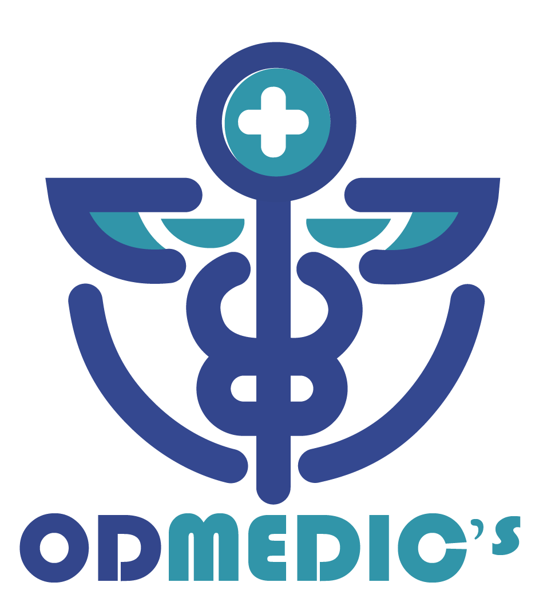

# 🏥 GRUPO OD - Centro Médico Integral

<div align="center">



**Atención médica integral con profesionales especializados**

[](CHANGELOG.md)
[](#)
[](https://php.net)
[](https://getbootstrap.com)
[](#)

</div>

---

## 📋 Descripción

Sitio web informativo profesional para el Centro Médico **Grupo OD**, que ofrece servicios integrales de salud incluyendo:

- 💉 **OD Medics** - Medicina General y Especializada
- 🦷 **OD Odontologics** - Servicios Odontológicos Completos
- ✨ **OD Stetics** - Estética Médica Avanzada
- 📦 **OD Courier** - Importación de Productos Médicos

---

## ✨ Características Principales

### 🎨 Diseño Profesional
- ✅ Diseño moderno y responsive
- ✅ Animaciones suaves con AOS
- ✅ Efectos hover profesionales
- ✅ **Imágenes fijas sin parallax** (mejorado en v2.0)
- ✅ Indicador de progreso de scroll
- ✅ Botón "volver arriba" animado

### 🔍 SEO Optimizado
- ✅ Meta tags completos
- ✅ Open Graph para redes sociales
- ✅ Alt text descriptivo
- ✅ Robots.txt configurado
- ✅ Estructura semántica HTML5

### 🚀 Performance
- ✅ Lazy loading de imágenes
- ✅ Compresión GZIP
- ✅ Caché del navegador
- ✅ Rutas absolutas optimizadas
- ✅ Preconexión a fuentes

### 🔒 Seguridad
- ✅ Prepared Statements SQL
- ✅ Validación de inputs
- ✅ Headers de seguridad
- ✅ Archivos sensibles protegidos
- ✅ CSRF protection ready

### 📱 Responsive (✨ NUEVO - Completo Nov 2025)
- ✅ **5 breakpoints** (1024px, 768px, 640px, 480px, 360px)
- ✅ Menú hamburguesa funcional y responsive
- ✅ Imágenes adaptativas por dispositivo
- ✅ Tipografía escalable progresiva
- ✅ Touch optimization completa
- ✅ Footer responsive con layout flexible
- ✅ Blog completamente adaptativo
- ✅ Carruseles responsive (585px → 220px)
- ✅ Botones touch-friendly (min 44x44px)
- ✅ Sin scroll horizontal
- ✅ Testado en iPhone, Samsung, iPad

---

## 🛠️ Tecnologías

- **Frontend**: HTML5, CSS3, JavaScript ES6+
- **Framework**: Bootstrap 5.3.0
- **Animaciones**: AOS Library
- **Iconos**: Bootstrap Icons
- **Backend**: PHP 7.4+
- **Base de Datos**: MySQL/MariaDB
- **Servidor**: Apache (XAMPP)

---

## 📦 Instalación

### Requisitos Previos
- XAMPP (Apache + PHP + MySQL)
- PHP 7.4 o superior
- MySQL 5.7 o superior
- Navegador web moderno

### Pasos de Instalación

1. **Clonar el repositorio**
   ```bash
   cd C:\xampp\htdocs
   git clone [tu-repositorio] GrupoOD
   ```

2. **Configurar la base de datos**
   - Abrir phpMyAdmin: `http://localhost/phpmyadmin`
   - Importar el archivo: `db/centro_medico.sql`
   - O ejecutar manualmente:
     ```sql
     CREATE DATABASE centro_medico CHARACTER SET utf8mb4;
     ```

3. **Configurar conexión** (opcional)
   - Editar `php/conexion.php` si es necesario
   - Por defecto usa: `root` sin contraseña

4. **Iniciar servidor**
   - Abrir XAMPP Control Panel
   - Iniciar Apache y MySQL
   - Acceder a: `http://localhost/GrupoOD/`

---

## 📁 Estructura del Proyecto

```
GrupoOD/
├── 📄 index.php              # Página principal
├── 📄 odmedics.php           # Servicios médicos
├── 📄 odondoto.php           # Servicios odontológicos
├── 📄 robots.txt             # SEO
├── 📄 .htaccess             # Configuración Apache
├── 📂 css/
│   ├── estilos.css          # Estilos principales
│   ├── style.css            # Header/Footer
│   └── animations.css       # Animaciones
├── 📂 js/
│   └── main.js              # JavaScript principal
├── 📂 php/
│   ├── header.php           # Encabezado
│   ├── footer.php           # Pie de página
│   ├── conexion.php         # Base de datos
│   └── formulario.php       # Procesamiento
├── 📂 img/                   # Imágenes
├── 📂 db/
│   └── centro_medico.sql    # Base de datos
├── 📄 DOCUMENTACION.md       # Documentación técnica
└── 📄 CHANGELOG.md           # Historial de cambios
```

---

## 🎨 Paleta de Colores

| Color | Hex | Uso |
|-------|-----|-----|
| Azul Oscuro | `#354b8c` | Primario |
| Azul Medio | `#30588c` | Secundario |
| Azul Claro | `#329aa6` | Acentos |
| Gris Claro | `#f2f2f2` | Fondos |
| Negro | `#0d0d0d` | Textos |

---

## 📞 Información de Contacto

**Grupo OD - Centro Médico Integral**

- 📧 **Email**: [odmedicsas@gmail.com](mailto:odmedicsas@gmail.com)
- 📱 **Teléfonos**: 0980312202 / 0981732398
- 📍 **Dirección**: Hermandad Ferroviaria y Miguel Hermoso S11-115
- 🕐 **Horario**: 
  - Lun-Vie: 8:00 AM - 6:00 PM
  - Sábados: 9:00 AM - 2:00 PM

---

## 📝 Páginas Disponibles

### 🏠 Inicio (`index.php`)
- Carrusel de imágenes
- Servicios principales
- Equipo de especialistas
- Visión, Misión y Objetivos
- Formulario de contacto

### 💉 OD Medics (`odmedics.php`)
- Medicina General
- Medicina Ocupacional
- Especialidades Médicas

### 🦷 OD Odontologics (`odondoto.php`)
- Ortodoncia
- Implantes Dentales
- Estética Dental

---

## 🔄 Actualizaciones Recientes

### ✨ v2.1 (3 Noviembre 2025) - RESPONSIVO COMPLETO ✅

#### 📱 Responsive Design Total
1. **5 Breakpoints Implementados**:
   - 1024px (Tablets - iPad, Galaxy Tab)
   - 768px (Tablets pequeñas)
   - 640px (Móviles grandes - iPhone Plus, Galaxy S)
   - 480px (Móviles estándar - iPhone SE, Galaxy A)
   - 360px (Móviles muy pequeños)

2. **Optimizaciones Touch**:
   - Touch targets mínimo 44x44px
   - Hover effects deshabilitados en touch devices
   - Smooth scrolling en carruseles
   - Menú hamburguesa mejorado
   - Sin scroll horizontal

3. **CSS Completamente Responsive**:
   - ✅ **estilos.css**: Tipografía escalable, carruseles adaptativos, botones responsive
   - ✅ **style.css**: Header, menú hamburguesa, footer adaptativo
   - ✅ **odblogs.css**: Blog completamente responsive

4. **Elementos Adaptativos**:
   - Logo: 35px → 28px
   - Carruseles: 585px → 220px
   - Tipografía: 16px → 12px
   - Menú lateral: 280px → 100%
   - Botón volver arriba: 50px → 40px

5. **Páginas Optimizadas**:
   - ✅ index.php
   - ✅ odmedics.php
   - ✅ odondoto.php
   - ✅ servicios.php
   - ✅ odblogs.php

### ✅ v2.0 (14 Octubre 2025) - SEO y Optimización

1. **Eliminación del Parallax**: Imágenes fijas para mejor experiencia
2. **SEO Completo**: Meta tags, Open Graph, robots.txt
3. **Contenido Profesional**: Descripciones detalladas
4. **Seguridad Mejorada**: Prepared statements, headers de seguridad
5. **Performance Optimizada**: Lazy loading, caché, compresión
6. **Footer Mejorado**: Redes sociales, horarios, información completa
7. **Documentación**: Documentación técnica completa

---

## 🚀 Próximas Funcionalidades

- [ ] Sistema de citas en línea
- [ ] Panel de administración
- [ ] Blog de salud con más artículos
- [ ] Chat en vivo
- [ ] Google reCAPTCHA
- [ ] PWA (Progressive Web App)
- [ ] Dark mode
- [ ] Multilenguaje (ES/EN)

---

## 📚 Documentación Adicional

- [📖 Documentación Técnica Completa](DOCUMENTACION.md)
- [📋 Historial de Cambios](CHANGELOG.md)
- [🎨 Guía de Estilos](GUIA-ESTILOS.md)
- [✅ Checklist de Desarrollo](CHECKLIST.md)

---

## 🤝 Contribución

Este es un proyecto propietario de Grupo OD. Para sugerencias o reportes de bugs, contactar al equipo de desarrollo.

---

## 📄 Licencia

© 2025 Grupo OD - Todos los derechos reservados

---

## 👨‍💻 Desarrolladores

**Equipo de Desarrollo Grupo OD**

---

<div align="center">

**Hecho con ❤️ para Grupo OD**

[🏠 Inicio](#-grupo-od---centro-médico-integral) | 
[📋 Descripción](#-descripción) | 
[🛠️ Instalación](#-instalación) | 
[📞 Contacto](#-información-de-contacto)

</div>